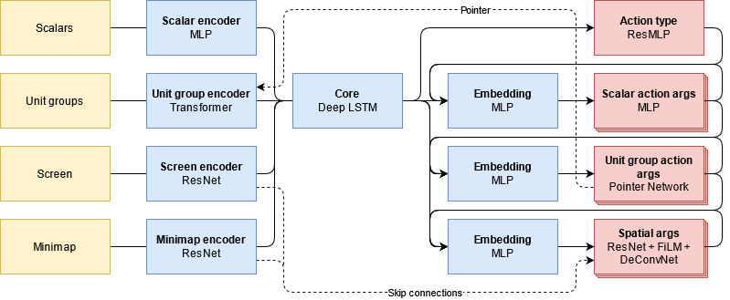

# StarCraft II Imitation Learning

This repository provides code to train neural network based StarCraft II agents from human demonstrations.
It emerged as a side-product of my Master's thesis, where I looked at representation learning from demonstrations for
task transfer in reinforcement learning.

The main features are:
  - Behaviour cloning from StarCraft II replays
  - Modular and extensible agents, inspired by the architecture of [AlphaStar](https://deepmind.com/blog/article/AlphaStar-Grandmaster-level-in-StarCraft-II-using-multi-agent-reinforcement-learning) but using the feature-layer interface instead of the raw game interface 
  - Hierarchical configurations using [Gin Config](https://github.com/google/gin-config) that provide great degree of flexibility and configurability
  - Pre-processing of large-scale replay datasets
  - Multi-GPU training
  - Playing against trained agents (Windows / Mac)
  - [Pretrained agents](#pre-trained-agents) for the Terran vs Terran match-up

## Table of Contents  
[Installation](#installation)  
[Train your own agent](#train-your-own-agent)  
[Play against trained agents](#play-against-trained-agents)  
[Download pre-trained agents](#download-pre-trained-agents)  

## Installation

### Requirements

- Python >= 3.6
- StarCraft II >= 3.16.1 (**4.7.1 strongly recommended**)

To install StarCraft II, you can follow the instructions at https://github.com/deepmind/pysc2#get-starcraft-ii. <br>

On Linux: From the available versions, version 4.7.1 is strongly recommended. 
Other versions are not tested and might run into compatibility issues with this code or the PySC2 library. 
Also, replays are tied to the StarCraft II version in which they were recorded, and version 4.7.1 has the largest number of replays currently available through the Blizzard Game Data APIs.

On Windows/MacOS: The binaries for a certain game version will be downloaded automatically when opening a replay of that version via the game client. 


### Get the StarCraft II Maps

Download the [ladder maps](https://github.com/Blizzard/s2client-proto#map-packs) and extract them to the `StarCraftII/Maps/` directory.

### Clone repository

```shell script
git clone https://github.com/metataro/sc2_imitation_learning.git
```

### Install Python libraries

```shell script
pip install -r requirements.txt
```

## Train your own agent

### Download replay packs

There are replay packs available for [direct download](https://github.com/Blizzard/s2client-proto#replay-packs), 
however, a much larger number of replays can be downloaded via the [Blizzard Game Data APIs](https://develop.battle.net/documentation/guides/game-data-apis).

The download of StarCraft II replays from the Blizzard Game Data APIs is described [here](https://github.com/Blizzard/s2client-proto/tree/master/samples/replay-api).
For example, the following command will download all available replays of game version 4.7.1:

```shell script
python -m scripts.download_replays \
  --key <API_KEY> \
  --secret <API_SECRET> \
  --version 4.7.1 \
  --extract \
  --filter_version sort
```

### Prepare the dataset

Having downloaded the replay packs, you can preprocess and combine them into a dataset as follows:

```shell script
python -m scripts.build_dataset \
  --gin_file ./configs/1v1/build_dataset.gin \
  --replays_path ./data/replays/4.7.1/ \
  --dataset_path ./data/datasets/v1
```

### Run the training

After preparing the dataset, you can run behaviour cloning training as follows:

```shell script
python -m scripts.behaviour_cloning --gin_file ./configs/1v1/behaviour_cloning.gin 
```

By default, the training will be parallelized across all available GPUs.
You can limit the number of used GPUs by setting the environment variable `CUDA_VISIBLE_DEVICES`.

The parameters in `configs/1v1/behaviour_cloning.gin` are optimized for a hardware setup with four Nvidia GTX 1080Ti GPUs 
and 20 physical CPUs (40 logical CPUs), where it takes around one week to complete.
Additionally, there are two other configurations targeted at machines with a single Nvidia GTX 1080Ti GPU: 
one with a smaller batch size and gradient accumulation (`configs/1v1/behaviour_cloning_single_gpu.gin`)
and one with a smaller network architecture (`configs/1v1/behaviour_cloning_small.gin`).
The former requires more time to train, and the latter produces significantly weaker agents.
You may need to adjust these configurations to fit your hardware specifications.

By default, logs are written to a tensoboard log file inside the experiment directory. 
You can also enable logging to [Weights & Biases](https://wandb.ai/) by setting the flag `--wandb_logging_enabled`.


### Run the evaluation

You can evaluate trained agents against built-in A.I. as follows:

```shell script
python -m scripts.evaluate --gin_file configs/1v1/evaluate.gin --logdir <EXPERIMENT_PATH>
```

Replace `<EXPERIMENT_PATH>` with the path to the experiment folder of the agent.
This will run the evaluation as configured in `configs/1v1/evaluate.gin`. 
By default, all available GPUs will be considered and evaluators will be split evenly across them.
You can limit the number of used GPUs by setting the environment variable `CUDA_VISIBLE_DEVICES`.


## Play against trained agents

You can challenge yourself to play against trained agents.

First, start a game as human player:

```shell script
python -m scripts.play_agent_vs_human --human
```

Then, in a second console, let the agent join the game:

```shell script
python -m scripts.play_agent_vs_human --agent_dir <SAVED_MODEL_PATH>
```

Here, replace `<SAVED_MODEL_PATH>` with the path to the where the model is stored (e.g. `/path/to/experiment_dir/saved_model`).

## Download pre-trained agents

There are pre-trained agents available for download:

https://drive.google.com/drive/folders/1PNhOYeA4AkxhTzexQc-urikN4RDhWEUO?usp=sharing

### Agent 1v1/tvt_all_maps

#### Evaluation results

The table below shows the win rates of the agent when evaluated in TvT against built-in AI with randomly selected builds.
Win rate for each map and difficulty level were determined by 100 evaluation matches.


| Map | Very Easy | Easy | Medium | Hard |
|:----|---------:|----:|------:|----:|
| KairosJunction | 0.86 | 0.27 | 0.07 | 0.00 |
| Automaton | 0.82 | 0.33 | 0.07 | 0.00 |
| Blueshift | 0.84 | 0.41 | 0.03 | 0.00 |
| CeruleanFall | 0.72 | 0.28 | 0.03 | 0.00 |
| ParaSite | 0.75 | 0.41 | 0.02 | 0.01 |
| PortAleksander | 0.72 | 0.34 | 0.05 | 0.00 |
| Stasis | 0.73 | 0.44 |  0.08 | 0.00 |
| **Overall** | **0.78** | **0.35** |  **0.05** | ~ **0.00** |


#### Recordings

Video recordings of cherry-picked evaluation games:

<table>
    <tr>
        <td>
            <strong>Midgame win vs easy A.I.</strong><br />
            <a href="http://www.youtube.com/watch?feature=player_embedded&v=h9844M_wkpI" target="_blank">
            
            </a>
        </td>
        <td>
            <strong>Marine rush win vs easy A.I.</strong><br />
            <a href="http://www.youtube.com/watch?feature=player_embedded&v=R348IWpFVAU" target="_blank">
            
            </a>
        </td>
    </tr>
    <tr>
        <td>
            <strong>Basetrade win vs hard A.I.</strong><br />
            <a href="http://www.youtube.com/watch?feature=player_embedded&v=AiHdhz2YyAE" target="_blank">
            
            </a>
        </td>
        <td></td>
    </tr>
</table>

#### Training data

<table>
    <tr>
        <td>Matchups</td>
        <td>TvT</td>
    </tr>
    <tr>
        <td style="white-space: nowrap;">Minimum MMR</td>
        <td>3500</td>
    </tr>
    <tr>
        <td style="white-space: nowrap;">Minimum APM</td>
        <td>60</td>
    </tr>
    <tr>
        <td style="white-space: nowrap;">Minimum duration</td>
        <td>30</td>
    </tr>
    <tr>
        <td>Maps</td>
        <td>KairosJunction, Automaton, Blueshift, CeruleanFall, ParaSite, PortAleksander, Stasis</td>
    </tr>
    <tr>
        <td>Episodes</td>
        <td>35'051 (102'792'317 timesteps)</td>
    </tr>
</table>

#### Interface

<table>
    <tr>
        <td style="white-space: nowrap;">Interface type</td>
        <td>Feature layers</td>
    </tr>
    <tr>
        <td style="white-space: nowrap;">Dimensions</td>
        <td>64 x 64 (screen), 64 x 64 (minimap)</td>
    </tr>
    <tr>
        <td style="white-space: nowrap;">Screen features</td>
        <td>visibility_map, player_relative, unit_type, selected, unit_hit_points_ratio, unit_energy_ratio, unit_density_aa</td>
    </tr>
    <tr>
        <td style="white-space: nowrap;">Minimum features</td>
        <td>camera, player_relative, alerts</td>
    </tr>
    <tr>
        <td style="white-space: nowrap;">Scalar features</td>
        <td>player, home_race_requested, away_race_requested, upgrades, game_loop, available_actions, unit_counts, build_queue, cargo, cargo_slots_available, control_groups, multi_select, production_queue</td>
    </tr>
</table>

#### Agent architecture



